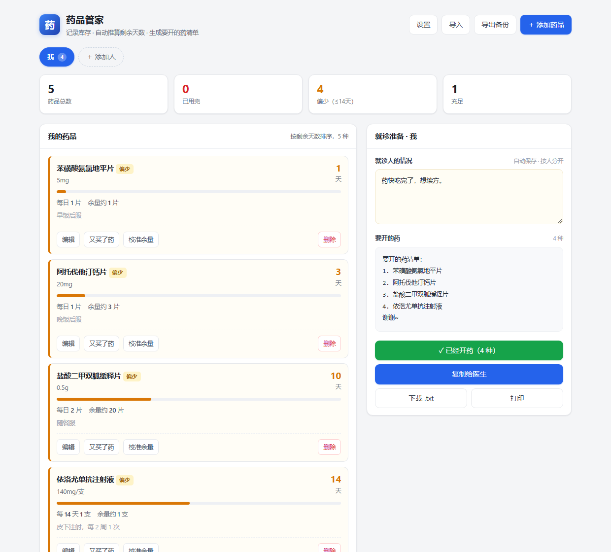
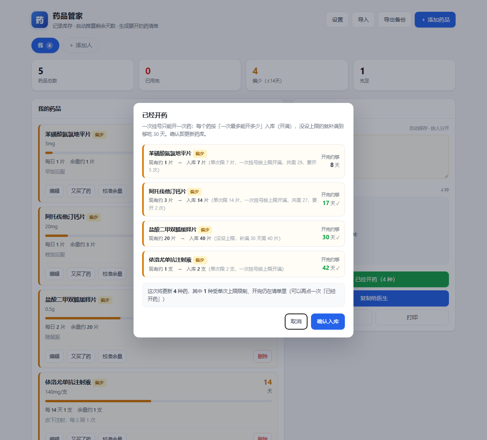

# 药品管家 drug-keeper

**在线试用** → <https://4dcf44c9286d4d28a2ba54368a33c7a4.app.workbuddy.host>

手机或电脑浏览器打开就能用，不用下载、不用装东西。
（把 `index.html` 存到本地双击打开也一样——那样连开页面都不用联网。）

**记一次库存，之后该开什么药、该开多少，它自己算。**

一个 HTML 文件，双击就开，不用装、不用联网、没有后端。数据只存在你自己的浏览器里。

给长期吃几种药的人用。尤其是**在互联网医院续方**的那种：每次都要在问诊框里手打一串药名，
少打一个医生就漏开一个，打完还得自己核对上次开了几盒、够不够吃到下次复诊。

这个程序把这件事翻过来：**先把家里有什么药、怎么吃记一遍，之后只顾着看颜色**。



---

## 它替你算三件事

| 算的 | 怎么算 |
|---|---|
| **还能吃到哪天** | 记录时填「余量 + 记到哪天」，之后每天自动往下推，卡片上直接写「剩 3 天」 |
| **要不要开** | 剩余天数 ≤ 你设的「偏少线」（默认 14 天），这张卡片就转黄并进右侧清单 |
| **这次开多少** | 按「一次最多能开多少」（单次处方限量）算；没填上限的就按「补满 N 天」倒推 |

算完的结果在右侧合成一段话 —— **就诊人的情况 + 要开的药清单**，一次复制，直接粘进问诊框：

```
药快吃完了，想续方。

要开的药清单：
1. 苯磺酸氨氯地平片
2. 阿托伐他汀钙片
谢谢~
```



---

## 三档，一眼就够

卡片的档位只有三个词：**已用完 / 偏少 / 充足**。
不带「告急」「将尽」这类词 —— 天天看的东西，不想被自己的工具吓。

只有**一条线**：偏少线（默认「剩余 ≤ 14 天」，设置里可改）。
越过它，卡片转黄、进右侧清单、上面「偏少（≤14天）」的计数也加一 ——
界面各处说的都是同一个数，不会出现「设置里写 7、统计里写 14」这种自相矛盾。

**看到黄就该补药了**，要补多少是点「已经开药」时才看的细节，不摆在卡片上。

---

## 两种吃药节奏，都支持

| 节奏 | 怎么填 | 例子 |
|---|---|---|
| **每天吃** | 「每 **1** 天 **2** 次」 | 二甲双胍，随餐服用 |
| **隔 N 天一次** | 「每 **14** 天 **1** 次」 | 依洛尤单抗，两周打一支 |

间隔药有两个数容易混，程序分开算，也分开说：

| 问的 | 口径 | 依洛尤（每 14 天 1 支）余 2 支时 |
|---|---|---|
| **还剩几支** | 按周期**离散**扣——过几个周期就扣几次 | 2 支（永远是整数，不会出现「1.5 支」） |
| **够到哪天** | 按**平均**速率算——一支管两周 | 28 天（第 28 天才是下次该打的日子） |

这两种口径回答的是不同问题：一个问「手上还有多少」，一个问「能顶到哪天」。
所以间隔药在列表里显示的是**天数**，不是「还剩 1.5 支」这种会让人以为程序坏了的数。

---

## 「一次挂号只能开一次药」

续方时最容易漏的一环：**一种药可能一次开不够**。

所以每个药可以填「**一次最多能开多少**」。填了以后：

- 点「**已经开药**」→ 每个药**按它自己的上限入库**（没填上限的就补满到目标天数），
  界面上直接标出「开完约够 N 天」，够了的打勾；
- 被上限卡住、一次开不完的，当场写明「共需 X，要开 N 次」；
- 确认后一次更新整箱库存，并告诉你**还有几种没到位**，再点一次就行。

把「开了药 → 更新药箱」从 N 次点击压成 **1 次**。

---

## 多人分开记

每个家庭成员一个药箱，彼此独立，清单也分开出。
顶部点名字就切人，「就诊人的情况」也是按人存的、自动保存、关掉再打开还在。

---

## 数据在哪

**只在你这台机器的浏览器里**（`localStorage`），不上传、不联网、没有服务器。
换电脑或清了浏览器数据就用「**导出备份**」的 JSON 文件，在新机器上「导入」还原。

也正因为如此：**这个程序不判断你该不该吃药、也不推荐药品**。
它只是把你告诉它的用量算成天数和份数。开什么药、开多少，是医生的事。

---

## 项目结构

```
index.html            程序本体：单文件，拷走就能跑
_check/test_rxcap.py  自检脚本 —— 无头 Chrome 跑 34 项断言（口径、入库、文案）
_check/shot.py        重新生成 docs/ 里的截图
docs/                 README 用的截图
```

改完程序想自己验一遍：

```bash
python _check/test_rxcap.py
```

它会用无头 Chrome 打开一份临时副本（数据由脚本临时注入，不会写回 `index.html`），
把 34 条断言的通过情况打印出来，退出码非 0 就是有回归。

> 程序内**没有内置示例数据**，打开就是空药箱 —— 示例数据里带着病情描述，不该跟着代码分发。

---

## 浏览器要求

任意现代浏览器（Chrome / Edge / Safari / 手机自带浏览器都行）。
不需要联网、不需要装任何东西。手机上可以用「添加到主屏幕」当 App 用。

---

## 许可

MIT（见 [LICENSE](LICENSE)）。
